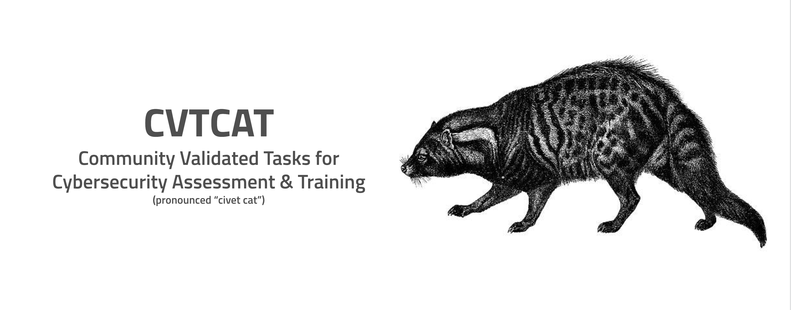

# Community Validated Tasks for Cybersecurity Assessment & Training (CVTCAT)

This is a new project aimed at building a community managed list of training resources for people who want to learn about cybersecurity.  This project is a single place to find free training and assessment resources managed entirely by the community.

